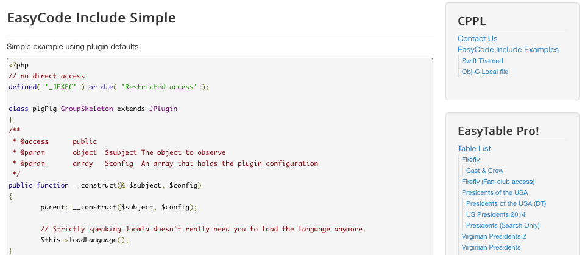
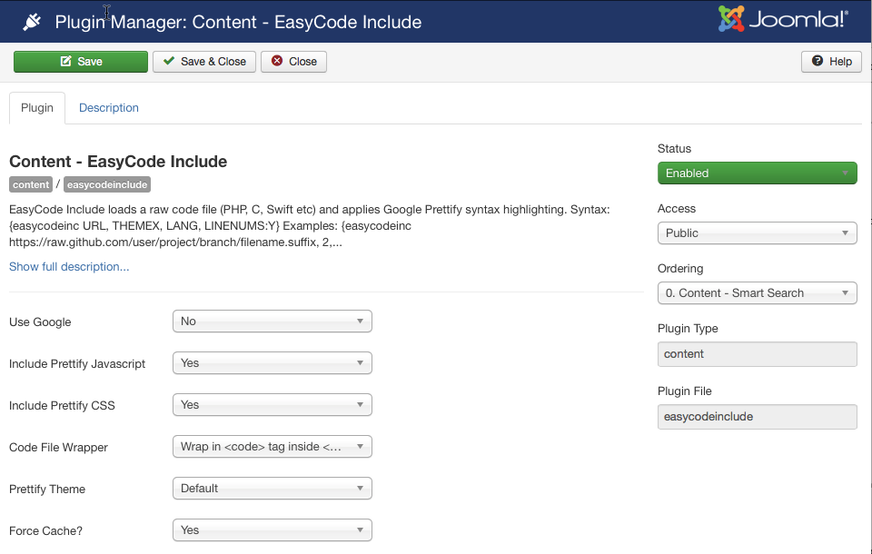

# EasyCode Include
EasyCode Include is a simple Joomla! 3.x (and 2.5) content plugin that imports a raw source code file and inserts it inline in your articles or anywhere else a content plugin will work.

## Using EasyCode Include

### Results:

The image below shows the formatted output of a section of a PHP file included from a GitHub Repository.

EasyCode Include loads the code file from a local webserver path or a website URL (e.g. from GitHub or any other URL that links to a raw code file) and applies Google Prettify syntax highlighting.

### It's not a Git Only World
In this example we're actually using a code file hosted on Google's Code repository - really it doesn't matter where the file is hosted as long as the URL you give the plugin returns just the code file. If the URL returns a HTML page with the code inside it the HTML will be formatted and presented in the page as well.

## Usage
### Syntax:

`{easycodeinc URL, THEMEX, LANG, LINENUMS:Y}`

The most common error message you will receive is that the URL is incorrect, more specifically it will look like this:

> Sorry cURL failed to retreive the page, is the URL correct?.

### Examples:

`{easycodeinc https://raw.github.com/user/project/branch/filename.suffix, 2, php}`

`{easycodeinc https://raw.github.com/user/project/branch/filename.suffix, 2, php, linenums:20}`

`{easycodeinc https://raw.github.com/user/project/branch/filename.suffix, , , linenums:12}`

**URL** - The URL should point to the raw code file and be of the form

`https://raw.github.com/user/project/branch/filename.suffix`

If the URL doesn't start with http but does start with a leading slash /  then EasyCode Include will attempt to load a local file relative to the root of the website. The example below will load a file in the /images/code_samples/ directory.

`{easycodeinc /images/code_samples/skynet.c}`

**THEME X** - This is an optional parameter, if its not provided the setting in the plugin will be used. If it is provided it must be from 0 to 3 where X is one of the following:

 0 - i.e. 0 = Default Theme  
 1 - i.e. 1 = Desert  
 2 - i.e. 2 = Sunburst  
 3 - i.e. 3 = Sons Of Obsidian  
 4 - i.e. 4 = Doxy

If you use multiple code blocks on a single page only the theme of the first code block will be used.

**LANG** - This is an optional parameter, if its not provided the file suffix from the URL will be used. If it is provided it overrides the URL's file suffix.

**LINENUMS:Y** - This is an optional parameter, if its provided Prettify will add line numbers to every 5th line. You can specify a starting line by using linenums:y where y is the first line number.

**RANGE X-Y** - This is an optional parameter, if its provided EasyCode Include will only display lines X through Y of the file. You must specify both a starting line and an end line number e.g. 20-30 where 20 is the first line number and 30 the last.

### Plugin Configuration
You can configure the EasyCode Include plugins default values from the Plugin Manager as you would with any other Joomla! plugin. Don't worry we've put all the syntax tips in the plugin's Description view and we've added useful tooltips to all of the settings.

## Use Google?
The Use Google option is a new feature in version 1.1.0 and allows you to use the Prettify files on Googles servers, which most time will be faster than using your own servers. Please note at the time of this writing note all languages supported by EasyCode Include are available In the CDN version, if you need a language style that isn't on the plugin try setting this option to NO to see if the plugin has it.

## Include Prettify Javascript
If you're not using Googles servers, this option allows you to prevent the inclusion of the Prettify.js files (if for example you're already including them through another means).

## Include Prettify CSS
If you're not using Googles servers, this option allows you to prevent the inclusion of the Prettify.css files (if for example you're already including them in your template CSS).

## Code File Wrapper
The raw code file is wrapped in a set of tags with the options being:

 1. `<code>` tags for HTML5 templates  
 - `<code>` tags inside `<pre>` tags for non-HTML5 templates  
 - `<pre>` only tags for old templates and browsers  

If you're using a pure HTML5 template you will want to change this setting from the default to "Wrap in `<code>` tags".

## Prettify Theme
Allows you to set a default theme to be used when one isn't specified in the tags you embed in your article.

## Force Cache?
The one setting you may be tempted to play with is the "Force Cache" setting. Simply put as the plugin runs on your webserver it has to first retrieve the contents of the URL from another server, sometimes on less expensive hosting services this can take several seconds, which your end user will see as being a slow page load from your website.

To avoid this issue the Joomla! cache is, by default, used even if you have Joomla!'s Global Cache setting turned off. To make the plugin obey your Joomla! settings simply set "Force Cahce?" to "No". Of, course this means if you have the cache turned off globally then your end users will see a pause on every page that uses the plugin.

The cache is relatively smart, in that we cache the retrieved code file against a hash of it source URL, so even if the source file is used in multiple articles in your website it will only be retrieved once during each cache cycle.

If you are loading your code file from the local webserver (i.e. somewhere inside your website root directory) then you can set this to "No" with minimal performance impact.

#### Notes:
- the plugin is called `plg_easycodeinclude` and can be [found here](https://extensions.joomla.org/extensions/extension/core-enhancements/coding-a-scripts-integration/easycode-include) on the [Joomla Extension Directory (JED)](http://extensions.joomla.org).

## Credits

EasyCode Include is made possible by Google Code Prettify
